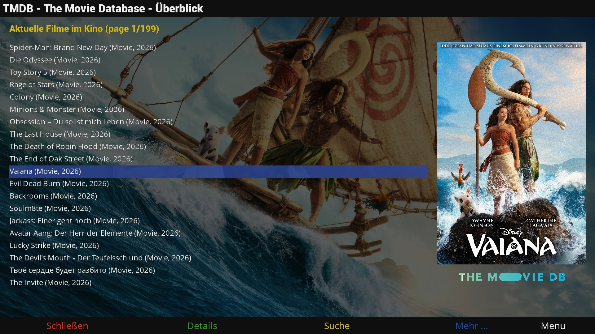

# TMDBCockpit
Browse/query TMDB Database

## Features
- Shows detailed movie/tv show information provided by TMDB.
- Can be invoked thru movie lists (standard, EMC, etc.) or thru red key in EPG lists.
- Provides an interface for other plugins to access TMDB data without opening TMDBCockpit screens.
- Allows to save movie as well as series episode covers, descriptions and backdrops.
- Allows unique tmdb api key in /etc/enigma2/tmdb_key.txt
- Allows playback of YouTube trailers.

## Disclaimer
The project author is not responsible for how this software is used by others. It is not intended to be used for accessing or distributing copyrighted materials without authorization.
Users are solely responsible for determining the legality of their actions.

This repository has no control over the streams, links, or the legality of the content provided by the different hosts (including all mirror sites). It is the end user's responsibility to ensure the legal use of these streams, and we strongly recommend verifying that the content complies with all applicable laws, including copyright laws and regulations of your country's jurisdiction before use.

## Limitations
- Tested on OpenViX and OpenATV with DM900.

## Links
- Installation: https://OpenCockpit.github.io/TMDBCockpit
